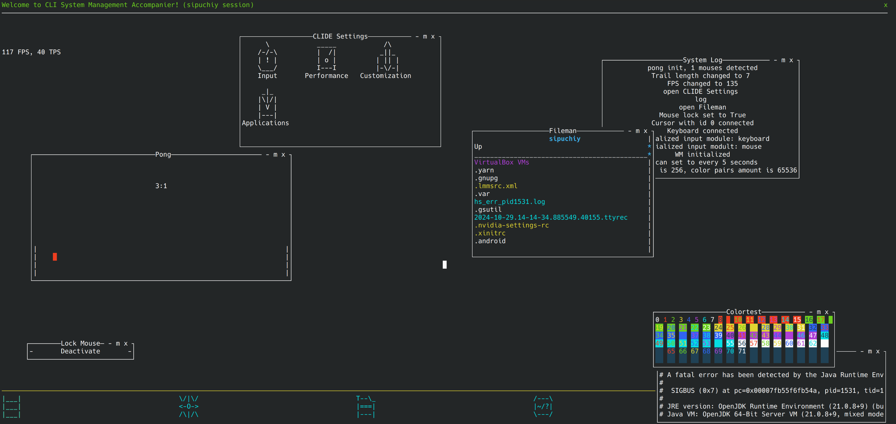
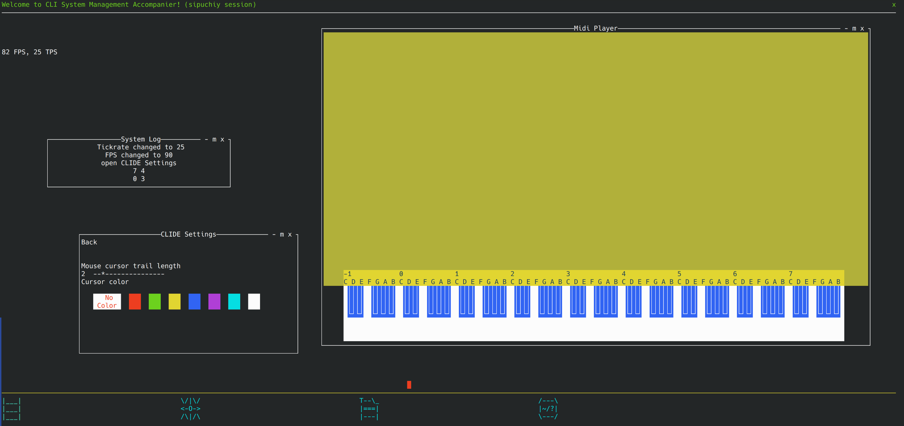

# CLISMA

**CLISMA** is an console-based desktop enviroment. Made mostly for fun using python.

> Stands for 'Command-Line-Interface System Manager Accompanier'




## Cool Features

- poorly documented

- dependency-free (there is exceptions, see requirements)

- external apps support - friendly environment for developing new packages; package manager

- all input and windowing job are done for developer; just append strings to the window

- premade ui elements: sliders, buttons, text fields

- standard-looking window system

- fancy features like many mouse cursors support or midi keyboard support

- runs smooth on old pcs

This app is currently unfinished and requies testing.

## Requirements

- curses for python (preinstalled for linux)

- python 3.10 or newer (possible to launch on python 3.7 with minimal effort (patch FileSquad/clismaconfig.py))
  
  additional: (unneccesary)

- pympler (for python)

- psutil (for python)

- alsa

## Recommended Hardware Requirements

CLIsma requires:

- 15-30 mb of RAM

- About 5 mb on disk

- CPU: tested on 800 mHz 1 core CPU

- No GPU required

- 8 color support (unneccesary)

## Use

Execute **main.py**. *You must* have access to /dev/input.
This could be arranged by adding your user into input group or running python with sudo or root.

> all input is received from from /dev/input.
> root privilegies isn't required for CLIsma shell.

```shell
sudo usermod -aG input $USER
```

then reboot.

```shell
cd CLIsma
pip install -r ./requirements-extra.txt
python main.py
```

### CLIsma has shell arguiments:

```
Usage: main.py --flag1 {required1} (optional2) --flag2 ...
Manipulate flag order to control order of execution
Use -# instead of - for opposite effect: supported commands marked with !
!   -b  --brief                                      Quick common info
!   -d, --debug                                      Debug mode
!   -f, --force                                      Disable confirmation (Warning: force deletion with -r)
!   -h, --help                                       Print this message
!   -i, --install {package_name} (archive_path)      Install a package
!   -r, --remove {package_name}                      Remove a package
!   -s, --shell                                      Shell mode (start CLIsma Shell)
    -l, --low-color                                  Force low color mode (compatibility)
```
